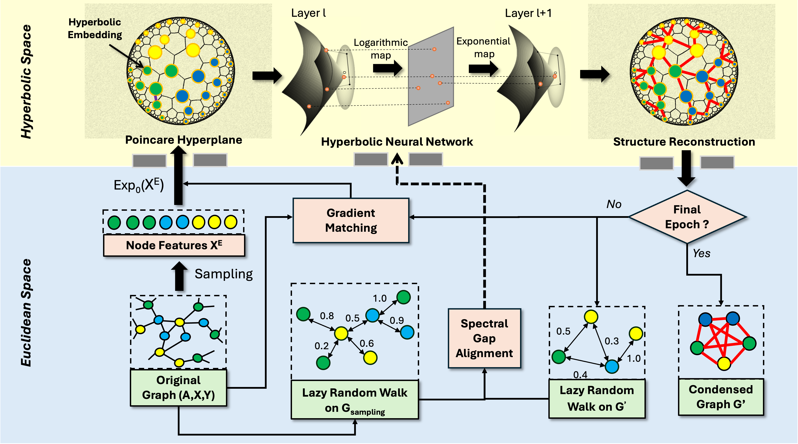

# HyDRO: Hyperbolic Graph Distillation Framework



## 📖 Overview

This repository implements two cutting-edge graph distillation methods:

1. **HyDRO**: Random Walk Guided Hyperbolic Graph Distillation  
   [](https://arxiv.org/abs/2501.15696)

2. **HyDRO+**: Efficient Privacy-Preserving Link Prediction  
   [](https://arxiv.org/html/2503.12156v1)

Built upon the [GraphSlim](https://github.com/Emory-Melody/GraphSlim/tree/main) framework.

## 🛠️ Installation

### System Requirements
| Component       | Version           |
|----------------|-------------------|
| PyTorch        | 1.13.1 or 2.1.2   |
| CUDA           | 12.4 (recommended)|
| Python         | ≥3.8              |

### Quick Setup
```bash
# For PyTorch 1.x
pip install -r requirements_torch1+.txt

# For PyTorch 2.x 
pip install -r requirements.txt

# Install PyG dependencies
pip install torch_scatter torch_sparse -f https://data.pyg.org/whl/torch-${TORCH}+${CUDA}.html
pip install graphslim


Note: The code automatically handles dataset downloads for:
- cora, citeseer, flickr, reddit (via PyG)
- arxiv (via GraphSAINT)
- Default dataset path: ../../data

Experiment Scripts
-----------------
The following scripts are available in run/scripts/:

1. Core Experiments:
   - performance_HyDRO.sh: Runs HyDRO performance benchmarks
   - performance_HyDRO+.sh: Runs HyDRO+ performance benchmarks

2. Additional Analyses:
   - robustness.sh: Robustness evaluation
   - mia.sh: Membership inference attacks evaluation
   - visual.sh: Visualization distilled graphs
   - nas.sh: Neural architecture search experiments
   - graph_property.sh: Evaluates graph property preservation

Citation
--------
If you use this work, please cite the original papers:

@article{long2025random,
  title={Random Walk Guided Hyperbolic Graph Distillation},
  author={Long, Yunbo and Xu, Liming and Schoepf, Stefan and Brintrup, Alexandra},
  journal={arXiv preprint arXiv:2501.15696},
  year={2025}
}
@article{long2025efficient,
  title={Efficient and Privacy-Preserved Link Prediction via Condensed Graphs},
  author={Long, Yunbo and Xu, Liming and Brintrup, Alexandra},
  journal={arXiv preprint arXiv:2503.12156},
  year={2025}
}

Contact
-------
For questions or issues, please contact [yl892@cam.ac.uk]